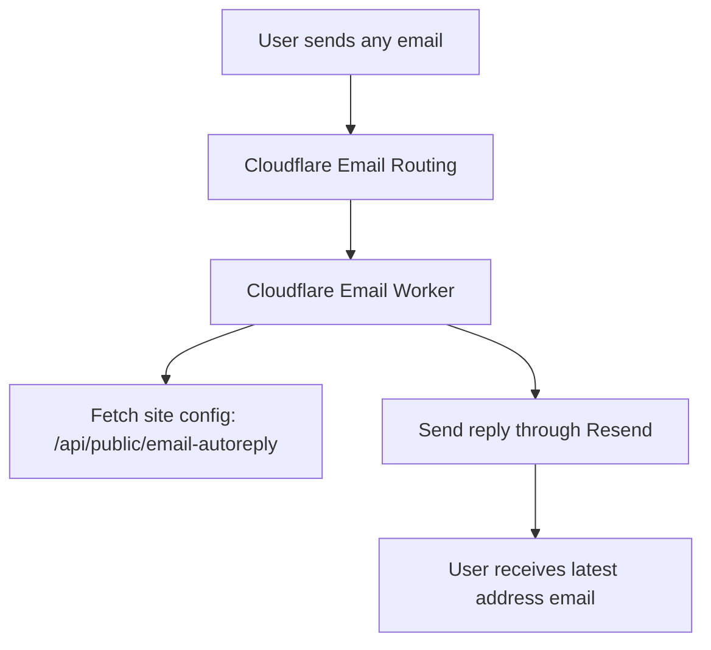

# Email Auto Reply

This project exposes the configurable reply content at:

```text
/api/public/email-autoreply
```

The admin panel has an `自动回信` page. Saving that page updates the `from`,
`subject`, and `text` returned by the public endpoint.

## Production Shape



Cloudflare receives the inbound email and triggers the Worker. Resend, Mailgun,
SES, or another outbound email provider sends the automatic reply. The included
Worker template uses Resend.

## Worker Setup

1. Create a Cloudflare Worker and paste
   `docs/cloudflare-email-autoreply-worker.js`.
2. Add an Email Routing rule that sends your address, for example
   `get@51cmtv.com`, to this Worker.
3. Verify the sender domain in Resend. The `from` address configured in the
   admin panel must use a domain Resend is allowed to send from.
4. Add Worker variables:

```text
CONFIG_URL=https://line1.51cmtv.com/api/public/email-autoreply
REPLY_FROM=51视频最新地址 <get@51cmtv.com>
REPLY_SUBJECT=51视频最新地址
FORWARD_TO=your-private-mailbox@example.com
```

Add this Worker secret:

```text
RESEND_API_KEY=your_resend_api_key
```

`FORWARD_TO` is optional. If set, the original inbound email is also forwarded
to your private mailbox.

## Current Default Text

```text
最新地址 🍉🍉🍉 (本信息更新时间 2026-05-20)


51视频最新官网 https://51cmtv.com  请把网址或者群分享给身边有需要的人，您的转发、分享是我们前进的动力😘～
```
